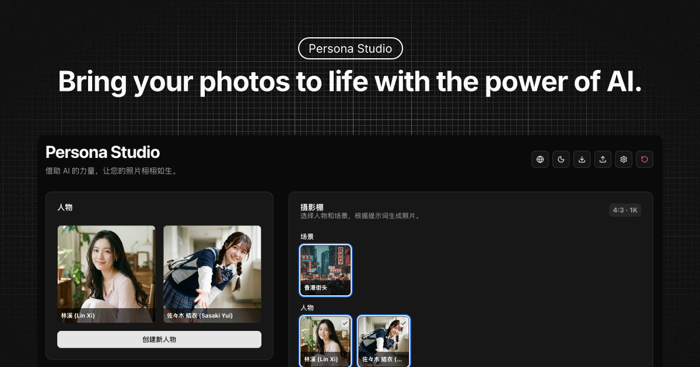
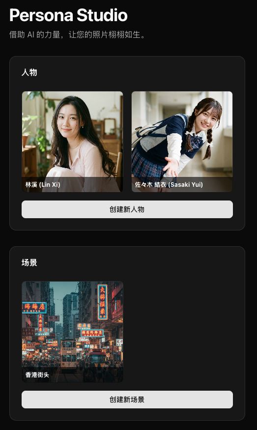
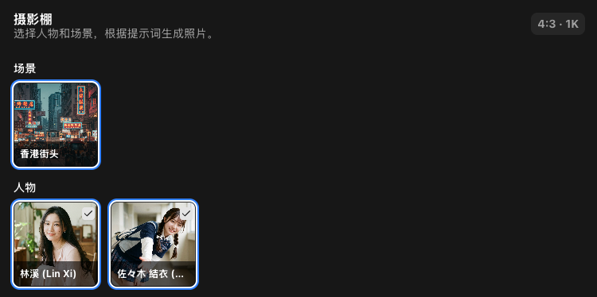
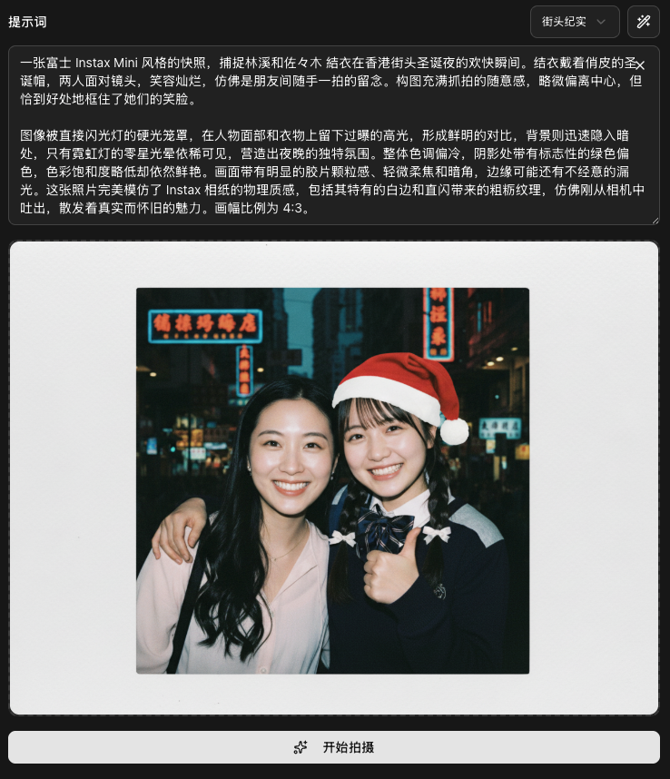

[English](./README.md) | [中文](./README_zh.md)



# Persona Studio

Persona Studio 是一款功能强大且直观的 Web 应用程序，专为创建和管理数字角色以及生成令人惊叹的 AI 图像而设计。它利用 Google Gemini API 的强大功能，为艺术家、设计师和故事讲述者提供无缝且富有创意的体验。

## 核心功能

- **高级角色创建**:
  - **多模态灵感生成**: 通过简单的文字想法、一张参考图片或两者的结合，生成详细的角色卡片。
  - **AI 创意扩展**: 让 AI 将您简短的角色概念扩展成内容丰富、细节详尽的描述。
  - **结构化编辑器**: 通过一个全面的结构化编辑器，微调角色的每一个方面，从基本信息、外貌特征到服装和情绪。
  - **直接上传**: 您也可以通过简单地上传图片并为其命名来创建角色。

- **多样化的场景创建**: 通过提供文本描述或上传您自己的图片，构建出身临其境的场景和环境。

- **动态摄影工作室**:
  - **场景构图**: 在一个专门的工作区中组合您创建的角色和环境，打造完美的场景。
  - **丰富的艺术风格**: 从包含 **14 种不同艺术风格** 的精选列表中进行选择，包括电影感、高级时尚、赛博朋克、复古胶片等，以定义您图像的外观和感觉。
  - **场景“灵感激发”**: 根据您选择的资源和艺术风格，生成富有创意的摄影提示，激发新想法。

- **AI 图像生成与微调**:
  - **高质量生成**: 根据您详细的构图生成高分辨率的图像。
  - **迭代式微调**: 轻松地优化和编辑您生成的图像。一个专门的模态窗口允许您使用新的提示，甚至参考图像来进行精确的调整，以影响构图和风格。
  - **完整的版本历史**: 不会错失任何一个好的镜头。该应用程序为每张照片维护一个完整的历史记录，让您可以随时回顾、比较和基于之前的版本进行创作。

- **项目与全局控制**:
  - **项目管理**: 轻松地将您的整个工作室项目（包括所有资源和照片）导入和导出为单个 `.zip` 文件，以便备份或迁移。
  - **生成设置**: 全局控制图像生成的参数，如宽高比和分辨率。
  - **UI 自定义**: 根据您的偏好，在浅色和深色主题以及多种语言（英文和中文）之间切换。
  - **重置功能**: 通过重置整个项目工作区，随时重新开始。

## 工作流程

Persona Studio 基于现代技术栈构建，包括 Next.js、React 和 Tailwind CSS。其核心功能由 Google Gemini API 驱动。

以下是工作流程的简要概述：

1.  **创建您的资源**:
    - **角色**: 使用 `角色创建器`。您可以从一个简单的想法或一张参考图片开始，让 AI 生成一张详细的 **角色卡片**。然后，使用结构化编辑器在生成最终的角色肖像之前完善每一个细节。
    - **环境**: 使用 `环境创建器` 通过文本提示或上传图片来定义您的场景。
2.  **在摄影工作室中设置场景**:
    - 选择一个或多个角色以及一个环境来放置他们。
    - 从可用的艺术风格列表中进行选择。
    - 编写一个描述场景的提示，或使用“灵感激发”按钮获取创意建议。
3.  **生成与优化**:
    - 点击“生成”来创建您的图像。应用程序会根据您的所有输入，智能地为 Gemini API 构建一个详细的提示。
    - 生成的图像会出现在查看器中。如果您想进行更改，请打开 **微调模态窗口**。在这里，您可以调整提示或添加参考图像来指导 AI 进行下一次迭代。
4.  **管理您的创作**:
    - 一张照片所有生成的版本都会保存在其 **历史时间线** 中。您可以轻松地在不同版本之间切换、下载您的最爱或删除它们。
    - 使用头部控件导出您的整个项目以进行安全保存。

## 屏幕截图

### 资源创建


*通过详细描述或上传您自己的图片来创建独特的角色和环境。*

### 资源选择


*轻松管理和选择您创建的资源，以便在摄影工作室中使用。*

### 摄影工作室


*应用程序的核心，您可以在这里组合资源、编写提示并生成令人惊叹的 AI 图像。*

## 快速上手

要开始使用 Persona Studio，您需要设置您的环境并安装必要的依赖项。

### 先决条件

- Node.js (v18 或更高版本)
- pnpm (或您偏好的包管理器)
- 一个 Google Gemini API 密钥

### 安装

1.  **克隆仓库:**
    ```bash
    git clone https://github.com/your-username/persona-studio.git
    cd persona-studio
    ```

2.  **安装依赖:**
    ```bash
    pnpm install
    ```

3.  **设置环境变量:**
    在项目根目录下创建一个 `.env.local` 文件，并添加您的 Google Gemini API 密钥：
    ```
    GEMINI_API_KEY=your_api_key_here
    ```

4.  **运行开发服务器:**
    ```bash
    pnpm dev
    ```

现在，应用程序将在 `http://localhost:3000` 上运行。

## 贡献

我们欢迎社区的贡献！如果您想做出贡献，请 fork 该仓库并提交包含您更改的 pull request。

## 许可证

该项目根据 MIT 许可证授权。有关更多详细信息，请参阅 `LICENSE` 文件。